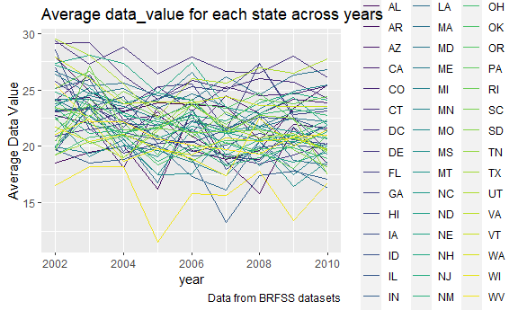
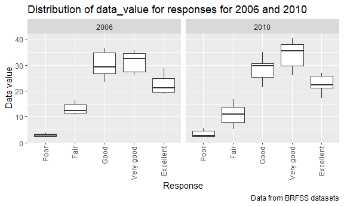
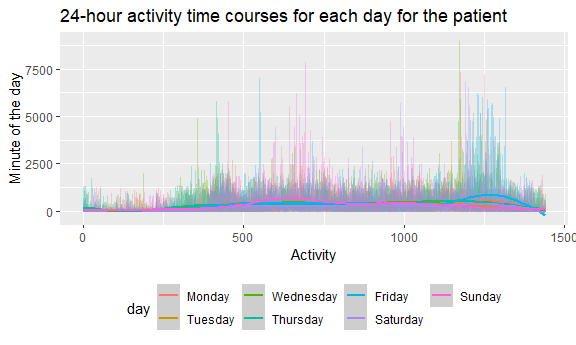

P8105\_HW3
================
Yijia Chen
2021-10-17

``` r
library(tidyverse)
```

# Problem 1

## Problem 1 (a)

Make a plot that shows the number of items ordered in each aisle,
limiting this to aisles with more than 10000 items ordered. Arrange
aisles sensibly, and organize your plot so others can read it.

``` r
library(p8105.datasets)
data("instacart")

numaisle_df = 
  instacart %>% 
  janitor::clean_names() %>% 
  count(aisle, name = "n_items") %>% 
  mutate(
    aisle_rank = min_rank(desc(n_items))
  )
```

    ## Warning in FUN(X[[i]], ...): strings not representable in native encoding will
    ## be translated to UTF-8

    ## Warning in FUN(X[[i]], ...): unable to translate '<U+00C4>' to native encoding

    ## Warning in FUN(X[[i]], ...): unable to translate '<U+00D6>' to native encoding

    ## Warning in FUN(X[[i]], ...): unable to translate '<U+00E4>' to native encoding

    ## Warning in FUN(X[[i]], ...): unable to translate '<U+00F6>' to native encoding

    ## Warning in FUN(X[[i]], ...): unable to translate '<U+00DF>' to native encoding

    ## Warning in FUN(X[[i]], ...): unable to translate '<U+00C6>' to native encoding

    ## Warning in FUN(X[[i]], ...): unable to translate '<U+00E6>' to native encoding

    ## Warning in FUN(X[[i]], ...): unable to translate '<U+00D8>' to native encoding

    ## Warning in FUN(X[[i]], ...): unable to translate '<U+00F8>' to native encoding

    ## Warning in FUN(X[[i]], ...): unable to translate '<U+00C5>' to native encoding

    ## Warning in FUN(X[[i]], ...): unable to translate '<U+00E5>' to native encoding

``` r
numaisle_df %>% 
  filter(n_items > 10000) %>% 
  mutate(
    aisle = fct_reorder(aisle, n_items)
    ) %>% 
  ggplot(aes(x = aisle, y = n_items)) +
  geom_point() + 
  theme(axis.text.x = element_text(angle = 90, vjust = 0.4, hjust = 1))
```

<!-- --> The
dimension of the “instacart” dataset is 1384617, 15. The number of
observation is 1384617. All variables in this dataset are order\_id,
product\_id, add\_to\_cart\_order, reordered, user\_id, eval\_set,
order\_number, order\_dow, order\_hour\_of\_day,
days\_since\_prior\_order, product\_name, aisle\_id, department\_id,
aisle, department. “reordered” means if this prodcut has been ordered by
this user in the past; 1 represents “YES” while 0 represents “NO”.
“order\_dow” means the day of the week on which the order was placed.
For example, the first observation is ordered by customer “112108” on
the 4th day of the week; the placing hour of this order is 10. The
product is “Bulgarian Yogurt” coming from “yogurt” aisle and “dairy
eggs” department.

The number of aisle is aisle, 134. Aisle that is the most itmes ordered
from is fresh vegetables, 150609, 1

## Problem 1 (b)

Make a table showing the three most popular items in each of the aisles
“baking ingredients”, “dog food care”, and “packaged vegetables fruits”.
Include the number of times each item is ordered in your table.

``` r
popitem_tb = 
  instacart %>% 
  janitor::clean_names() %>% 
  group_by(aisle, product_name) %>% 
  summarize(n_ord = n()) %>% 
  filter(aisle %in% c("baking ingredients", "dog food care", "packaged vegetables fruits")) %>%
  mutate(
    ord_rank = min_rank(desc(n_ord))
  ) %>% 
  filter(ord_rank < 4) %>% 
  knitr::kable()
```

    ## `summarise()` has grouped output by 'aisle'. You can override using the `.groups` argument.

``` r
popitem_tb
```

| aisle                      | product\_name                                 | n\_ord | ord\_rank |
|:---------------------------|:----------------------------------------------|-------:|----------:|
| baking ingredients         | Cane Sugar                                    |    336 |         3 |
| baking ingredients         | Light Brown Sugar                             |    499 |         1 |
| baking ingredients         | Pure Baking Soda                              |    387 |         2 |
| dog food care              | Organix Chicken & Brown Rice Recipe           |     28 |         2 |
| dog food care              | Small Dog Biscuits                            |     26 |         3 |
| dog food care              | Snack Sticks Chicken & Rice Recipe Dog Treats |     30 |         1 |
| packaged vegetables fruits | Organic Baby Spinach                          |   9784 |         1 |
| packaged vegetables fruits | Organic Blueberries                           |   4966 |         3 |
| packaged vegetables fruits | Organic Raspberries                           |   5546 |         2 |

## Problem 1 (c)

Make a table showing the mean hour of the day at which Pink Lady Apples
and Coffee Ice Cream are ordered on each day of the week; format this
table for human readers (i.e. produce a 2 x 7 table).

``` r
meanh_tb = 
  instacart %>% 
  janitor::clean_names() %>% 
  group_by(product_name, order_dow) %>% 
  summarise(
    mean_hod = mean(order_hour_of_day, na.rm = TRUE)
  ) %>% 
  filter(product_name %in% c("Pink Lady Apples", "Coffee Ice Cream")) %>% 
  pivot_wider(
    names_from = "order_dow",
    values_from = "mean_hod",
  ) %>% 
  knitr::kable()
```

    ## `summarise()` has grouped output by 'product_name'. You can override using the `.groups` argument.

``` r
meanh_tb
```

| product\_name    |        0 |        1 |        2 |        3 |        4 |        5 |        6 |
|:-----------------|---------:|---------:|---------:|---------:|---------:|---------:|---------:|
| Coffee Ice Cream | 13.77419 | 14.31579 | 15.38095 | 15.31818 | 15.21739 | 12.26316 | 13.83333 |
| Pink Lady Apples | 13.44118 | 11.36000 | 11.70213 | 14.25000 | 11.55172 | 12.78431 | 11.93750 |

# Problem 2

## Problem 2 (a)

First, do some data cleaning:

1.  format the data to use appropriate variable names;
2.  focus on the “Overall Health” topic;
3.  include only responses from “Excellent” to “Poor”;
4.  organize responses as a factor taking levels ordered from “Poor” to
    “Excellent”.

``` r
library(p8105.datasets)
data("brfss_smart2010")

brfss_df = 
  brfss_smart2010 %>% 
  janitor::clean_names() %>% 
  filter(
    topic %in% "Overall Health",
    response %in% c("Excellent", "Very good", "Good", "Fair", "Poor")
  ) %>% 
  mutate(
    response = factor(response, levels = c("Poor", "Fair", "Good", "Very good", "Excellent"))
    )
```

## Problem 2 (b)

Using this dataset, do or answer the following (commenting on the
results of each):

In 2002, which states were observed at 7 or more locations? What about
in 2010?

``` r
health_02 = 
  brfss_df %>% 
  select(year, locationabbr, locationdesc) %>% 
  group_by(year, locationabbr) %>% 
  summarize(n_loc = n_distinct(locationdesc)) %>% 
  filter(
    year == 2002,
    n_loc > 6
    )
```

    ## `summarise()` has grouped output by 'year'. You can override using the `.groups` argument.

``` r
health_02    #The states that were observed at 7 or more locations in 2002
```

    ## # A tibble: 6 x 3
    ## # Groups:   year [1]
    ##    year locationabbr n_loc
    ##   <int> <chr>        <int>
    ## 1  2002 CT               7
    ## 2  2002 FL               7
    ## 3  2002 MA               8
    ## 4  2002 NC               7
    ## 5  2002 NJ               8
    ## 6  2002 PA              10

``` r
health_10 = 
  brfss_df %>% 
  select(year, locationabbr, locationdesc) %>% 
  group_by(year, locationabbr) %>% 
  summarize(n_loc = n_distinct(locationdesc)) %>% 
  filter(
    year == 2010,
    n_loc > 6
    )
```

    ## `summarise()` has grouped output by 'year'. You can override using the `.groups` argument.

``` r
health_10    #The states that were observed at 7 or more locations in 2010
```

    ## # A tibble: 14 x 3
    ## # Groups:   year [1]
    ##     year locationabbr n_loc
    ##    <int> <chr>        <int>
    ##  1  2010 CA              12
    ##  2  2010 CO               7
    ##  3  2010 FL              41
    ##  4  2010 MA               9
    ##  5  2010 MD              12
    ##  6  2010 NC              12
    ##  7  2010 NE              10
    ##  8  2010 NJ              19
    ##  9  2010 NY               9
    ## 10  2010 OH               8
    ## 11  2010 PA               7
    ## 12  2010 SC               7
    ## 13  2010 TX              16
    ## 14  2010 WA              10

## Problem 2 (c)

Construct a dataset that is limited to Excellent responses, and
contains, year, state, and a variable that averages the data\_value
across locations within a state. Make a “spaghetti” plot of this average
value over time within a state (that is, make a plot showing a line for
each state across years)

``` r
health_exc = 
  brfss_df %>% 
  filter(response == "Excellent") %>% 
  group_by(year, locationabbr) %>% 
  mutate(
    mean_data_value = mean(data_value, na.rm = TRUE)
  ) %>% 
  select(year, locationabbr, mean_data_value) %>% 
  distinct() %>% 
  ggplot(aes(x = year, y = mean_data_value, color = locationabbr)) +
  geom_line() +
  viridis::scale_color_viridis(
    name = "State",
    discrete = TRUE
  ) +
  theme(legend.position = "bottom")

health_exc
```

<!-- -->

## Problem 2 (d)

Make a two-panel plot showing, for the years 2006, and 2010,
distribution of data\_value for responses (“Poor” to “Excellent”) among
locations in NY State.

``` r
health_dis =
  brfss_df %>% 
  filter(
    locationabbr %in% "NY",
    year %in% c(2006, 2010)
    ) %>% 
  select(year, locationabbr, response, data_value) %>% 
  drop_na(data_value) %>% 
  ggplot(aes(x = response, y = data_value)) +
  geom_boxplot() +
  facet_grid(. ~ year) +
  theme(axis.text.x = element_text(angle = 90, vjust = 0.4, hjust = 1))

health_dis
```

<!-- -->

# Problem 3

## Problem 3 (a)

Load, tidy, and otherwise wrangle the data. Your final dataset should
include all originally observed variables and values; have useful
variable names; include a weekday vs weekend variable; and encode data
with reasonable variable classes. Describe the resulting dataset

``` r
accel_df = 
  read.csv("data/accel_data.csv") %>% 
  janitor::clean_names() %>% 
  pivot_longer(
    activity_1:activity_1440,
    names_to = "min",
    names_prefix = "activity_",
    values_to = "activity"
  ) %>% 
  mutate(
    min = as.numeric(min),
    day = factor(day, levels = c("Monday", "Tuesday", "Wednesday", "Thursday", "Friday", "Saturday", "Sunday")),
    weekend = as.numeric(day %in% c("Saturday", "Sunday"))
  ) 
```

The dimension of the “accel\_df” dataset is 50400, 6. The number of
observation is 50400. All variables in this dataset are week, day\_id,
day, min, activity, weekend. “min” means the the activities are recorded
at what minute of the day.

## Problem 3 (b)

Traditional analyses of accelerometer data focus on the total activity
over the day. Using your tidied dataset, aggregate accross minutes to
create a total activity variable for each day, and create a table
showing these totals. Are any trends apparent?

``` r
accelto_tb = 
  accel_df %>% 
  group_by(week, day) %>% 
  summarize(
    total_act = sum(activity)
  ) %>% 
  pivot_wider(
    names_from = "day",
    values_from = "total_act"
  ) %>% 
  knitr::kable()
```

    ## `summarise()` has grouped output by 'week'. You can override using the `.groups` argument.

``` r
accelto_tb
```

| week |    Monday |  Tuesday | Wednesday | Thursday |   Friday | Saturday | Sunday |
|-----:|----------:|---------:|----------:|---------:|---------:|---------:|-------:|
|    1 |  78828.07 | 307094.2 |    340115 | 355923.6 | 480542.6 |   376254 | 631105 |
|    2 | 295431.00 | 423245.0 |    440962 | 474048.0 | 568839.0 |   607175 | 422018 |
|    3 | 685910.00 | 381507.0 |    468869 | 371230.0 | 467420.0 |   382928 | 467052 |
|    4 | 409450.00 | 319568.0 |    434460 | 340291.0 | 154049.0 |     1440 | 260617 |
|    5 | 389080.00 | 367824.0 |    445366 | 549658.0 | 620860.0 |     1440 | 138421 |

There is no apparent trends

## Problem 3 (c)

Accelerometer data allows the inspection activity over the course of the
day. Make a single-panel plot that shows the 24-hour activity time
courses for each day and use color to indicate day of the week. Describe
in words any patterns or conclusions you can make based on this graph

``` r
accelplot = 
  accel_df %>% 
  group_by(week, day) %>% 
  ggplot(aes(x = min, y = activity, color = day)) +
  geom_line(alpha = .3) +
  geom_smooth()

accelplot
```

    ## `geom_smooth()` using method = 'gam' and formula 'y ~ s(x, bs = "cs")'

<!-- -->
Activity of patient usually begin at 4am and end at the end of the day.
He is super active in the Sunday morning and at Friday night. At
Sunday’s and Tuesday’s night, he is less active than the other days.
